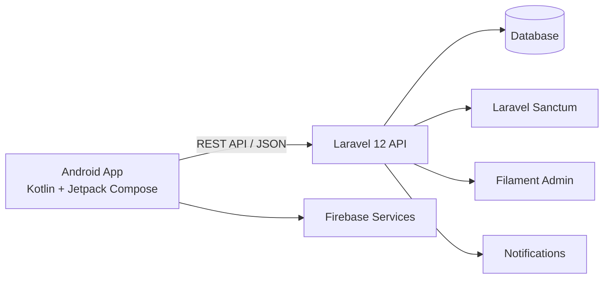
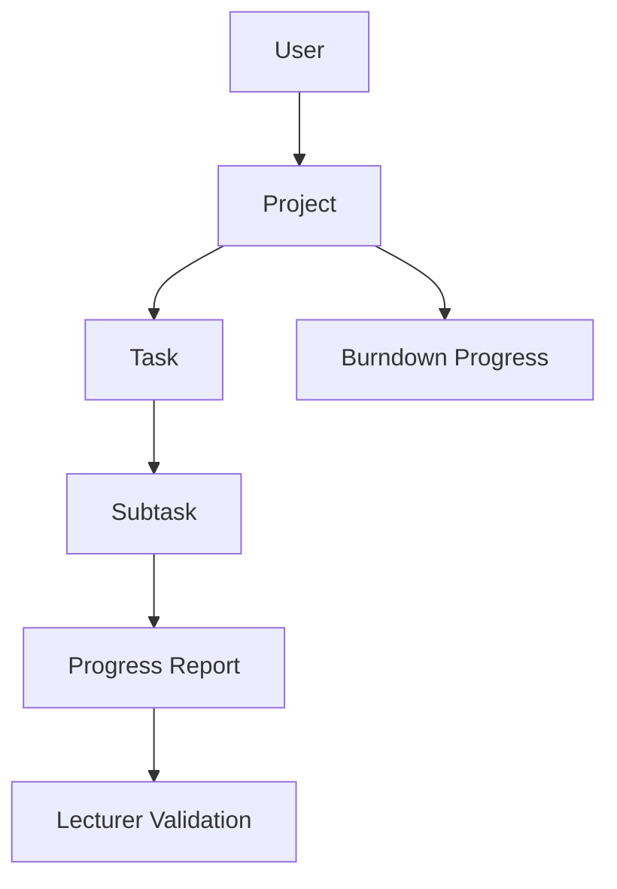

<div align="center">

# 🎓 Monitoring TA

### Android application for monitoring Final Project / Thesis progress

Built for **Mahasiswa** and **Dosen Pembimbing** to manage projects, tasks, progress reports, validation, notifications, and thesis progress from one mobile application.

[](https://kotlinlang.org/)
[](https://developer.android.com/compose)
[](https://m3.material.io/)
[](https://square.github.io/retrofit/)
[](https://dagger.dev/hilt/)
[](https://laravel.com/)

</div>

---

## ✨ Overview

**Monitoring TA** is an Android-based thesis monitoring application designed to make the supervision process more structured and transparent.

Students can organize their final-project work into projects, tasks, and subtasks, submit progress reports, and monitor their progress. Lecturers can monitor supervised students, review reports, validate submissions, provide feedback, and view project progress.

The Android client communicates with a Laravel REST API using token-based authentication.

## 🚀 Main Features

### 👨‍🎓 Mahasiswa

- Register and login
- Create and manage thesis projects
- Create tasks and subtasks
- Update task/subtask progress
- Upload progress reports
- View submitted report history
- View thesis progress dashboard
- Burndown chart visualization
- View PDF/document reports
- Receive report validation notifications
- Manage user profile

### 👨‍🏫 Dosen Pembimbing

- Login as lecturer
- View supervised students
- View student projects and project dashboards
- Monitor task and thesis progress
- View uploaded progress reports
- Preview report documents
- Validate or review reports
- Provide feedback to students
- Receive new-report notifications

## 🧩 System Architecture



### Application flow

```text
Student / Lecturer
       │
       ▼
Jetpack Compose UI
       │
       ▼
ViewModel
       │
       ▼
Repository
       │
       ▼
Retrofit API Service
       │
       ▼
Laravel REST API
```

## 🛠 Tech Stack

| Layer | Technology |
| --- | --- |
| Language | Kotlin |
| UI | Jetpack Compose + Material 3 |
| Architecture | ViewModel + Repository pattern |
| Networking | Retrofit + Gson |
| Dependency Injection | Dagger Hilt |
| Local Preferences | Android DataStore |
| Image Loading | Coil |
| Charts | MPAndroidChart |
| Document Viewer | PDF rendering / JetPDFVue |
| Authentication | Laravel Sanctum token |
| Backend | Laravel 12 REST API |
| Notifications | Firebase / application notifications |

## 📁 Project Structure

```text
app/src/main/java/com/tugas/
├── data/
│   ├── api/          # Retrofit API definitions
│   ├── model/        # Request/response models
│   └── repository/   # Data repositories & preferences
├── di/               # Hilt dependency injection
├── helper/           # Shared helpers
├── layout/
│   ├── ui/
│   │   ├── auth/       # Login & register
│   │   ├── mahasiswa/  # Student features
│   │   ├── dosen/      # Lecturer features
│   │   └── document/   # PDF/document viewer
│   └── navigasi/
├── route/            # Compose navigation
└── viewmodel/        # Screen state & business logic
```

## 🔗 Backend API

The Android application is powered by the Laravel backend repository:

👉 **[Monitoring TA Backend API](https://github.com/bayupra7ama/monitoring-ta-mobile)**

Backend capabilities include Laravel Sanctum authentication, project/task/subtask management, progress report validation, notifications, burndown data, and a Filament admin panel.

## ⚙️ Getting Started

### Prerequisites

- Android Studio
- JDK 8 or newer supported by your Android toolchain
- Android SDK
- Running Monitoring TA backend API
- Firebase configuration when Firebase services are used

### 1. Clone repository

```bash
git clone https://github.com/bayupra7ama/monitoring-ta.git
cd monitoring-ta
```

### 2. Configure API URL

Update the backend base URL in:

```text
app/src/main/java/com/tugas/di/AppModule.kt
app/src/main/java/com/tugas/data/api/RetrofitInstance.kt
```

Example:

```kotlin
.baseUrl("http://YOUR_BACKEND_URL/")
```

> The repository currently contains an ngrok development URL. Replace it with your active local/development/production backend URL before running the app.

### 3. Configure Firebase

Place your Firebase Android configuration at:

```text
app/google-services.json
```

Use the Firebase project associated with your own development environment.

### 4. Run the app

Open the project in Android Studio, sync Gradle, select an emulator/device, then run the application.

Or build from terminal:

```bash
./gradlew assembleDebug
```

Windows:

```powershell
.\gradlew.bat assembleDebug
```

## 🔐 Authentication & Roles

The API uses Laravel Sanctum tokens. Protected endpoints are separated by user role:

```text
Mahasiswa → project, task, subtask, report
Dosen     → mahasiswa bimbingan, dashboard, validation
Admin     → Filament administration panel
```

## 📊 Core Domain



## 🗺 Roadmap Ideas

- Production-ready API environment configuration
- Improved offline/error states
- Automated tests for repositories and ViewModels
- CI/CD Android build pipeline
- In-app push notification improvements
- Release APK/AAB distribution

## 🤝 Related Project

| Repository | Purpose |
| --- | --- |
| **monitoring-ta** | Android Kotlin / Jetpack Compose client |
| **monitoring-ta-mobile** | Laravel 12 REST API & Filament admin |

---

<div align="center">

Made with Kotlin, Jetpack Compose, and Laravel for a more organized thesis supervision workflow.

</div>
